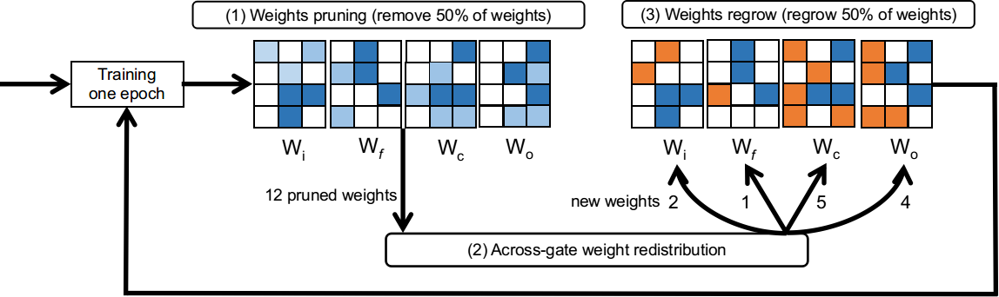

# Selfish-RNN Sparse Recurrent Neural Networks with Adaptive Connectivity

This repository is the official implementation of Neurips 2020 submission with ID 6137: Selfish-RNN Sparse Recurrent Neural Networks with Adaptive Connectivity



## Requirements

The library requires PyTorch v1.0.1 and CUDA v9.0. 
You can download it via anaconda or pip, see [PyTorch/get-started](https://pytorch.org/get-started/locally/) for further information. 

## Training

We provide the training codes of Selfish stacked-LSTM and Selfish RHN. 

To train Selfish stacked-LSTM on PTB dataset with GPU in the paper, run this command:

```
python main.py --sparse --optimizer sgd --model LSTM --cuda --growth random --death magnitude --redistribution none --nonmono 5 --batch_size 20 --bptt 35 --lr 40 --clip 0.25 --seed 1111 --emsize 1500 --nhid 1500 --nlayers 2 --death-rate 0.8 --dropout 0.65 --density 0.33 --epochs 100
```

To train Selfish RHN on PTB dataset with GPU in the paper, run this command:

```
python main.py --sparse --optimizer sgd --model RHN --cuda --tied --couple --seed 42 --nlayers 1 --growth random --death magnitude --redistribution none --density 0.472 --death-rate 0.5 --clip 0.25 --lr 15 --epochs 500 --dropout 0.65 --dropouth 0.25 --dropouti 0.65 --dropoute 0.2 --emsize 830 --nhid 830

```

To train Selfish ONLSTM on PTB dataset with GPU in the paper, run this two commands:

```
cd ONLSTM
python main_ONLSTM.py --sparse --optimizer sgd --growth random --death magnitude --redistribution none --density 0.45 --death-rate 0.5 --batch_size 20 --dropout 0.45 --dropouth 0.3 --dropouti 0.5 --nonmono 5 --wdrop 0.45 --chunk_size 10 --seed 141 --epoch 1000

```

Options:
* --sparse - Enable sparse mode (remove this if want to train dense model)
* --evaluate (str) - pretrained model path (default none)
* --model (str) - type of recurrent net, choose from RHN and LSTM (default LSTM)
* --optimizer (str) - type of optimizers, choose from sgd (Sparse NT-ASGD) and adam (default sgd)

* --growth (str) - regrow mode. Choose from: momentum, random, gradient (default random)
* --death (str) - pruning mode. Choose from: magnitude, SET, threshold (default magnitude)
* --redistribution (str) - redistribution mode. Choose from: momentum, magnitude, nonzeros, or none. (default none)
* --density (float) - density level (default 0.33)
* --death-rate (float) - initial pruning rate (default 0.5)

## Evaluation

To evaluate the pre-trained Selfish stacked-LSTM model on PTB, run:

```eval
python main.py --sparse --evaluate model_path --optimizer sgd --model LSTM --cuda --growth random --death magnitude --redistribution none --nonmono 5 --batch_size 20 --bptt 35 --lr 40 --clip 0.25 --seed 5 --emsize 1500 --nhid 1500 --nlayers 2 --death-rate 0.7 --dropout 0.65 --density 0.33 --epochs 100
```

To evaluate the pre-trained model, you need to replace the model_path with your model path and all the training hyper-parameters keep the same as the training command.

## Pre-trained Models

You can download the pretrained Selfish stacked-LSTM models here:

- [Selfish stacked-LSTM](https://drive.google.com/file/d/1CgiGL__yUi7oFMbeQT6Zj43T2MWGsbhT/view?usp=sharing) trained on PTB. 

This model gives 71.83 test perplexity on PTB dataset. To evaluate this pre-trained model, you need to run:

```eval
python main.py --sparse --evaluate model_path --optimizer sgd --model LSTM --cuda --growth random --death magnitude --redistribution none --nonmono 5 --batch_size 20 --bptt 35 --lr 40 --clip 0.25 --seed 5 --emsize 1500 --nhid 1500 --nlayers 2 --death-rate 0.7 --dropout 0.65 --density 0.33 --epochs 100
```
"model_path" is the path where you save this model.

## Results

Our model achieves the following performance on :

### [Selfish stacked-LSTM, RHN and ONLSTM on PTB dataset:]

| Model name            |   Sparsity   | Validation perplexity  | Test perplexity |
| ----------------------|--------------|----------------------- | --------------- |
| Selfish stacked-LSTM  |    0.33      |         73.79          |      71.72      |
| Selfish RHN           |    0.472     |         62.10          |      60.35      |
| Selfish ONLSTM_1000   |    0.450     |      58.17+-0.06       |   56.31+-0.10   |
| Selfish ONLSTM_1300   |    0.450     |      57.67+-0.06       |   55.82+-0.11   |

### [Selfish AWD-LSTM-MoS on Wikitext-2 dataset:]

| Model name                              |   Sparsity   | Validation perplexity  | Test perplexity |
| ----------------------------------------|--------------|----------------------- | --------------- |
| Selfish AWD-LSTM-MoS without finetuning |    0.450     |         65.96          |      63.05      |
